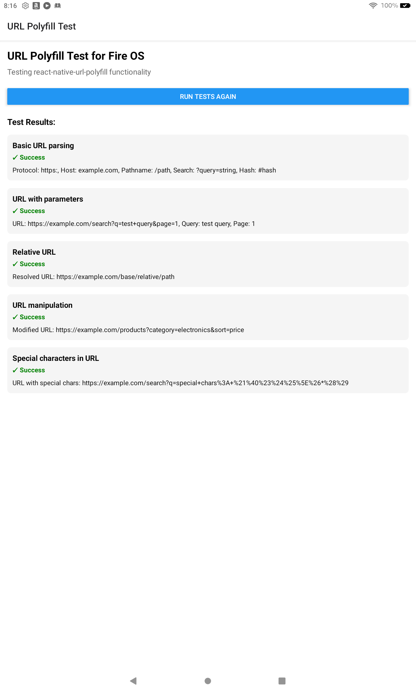

# URL Polyfill Test App for Fire OS

This app demonstrates the integration of [react-native-url-polyfill](https://github.com/charpeni/react-native-url-polyfill) with an Expo React Native application, specifically targeting Fire OS devices.

## Purpose

The purpose of this test app is to verify that the URL API polyfill works correctly on Fire OS devices, which may have limited or inconsistent support for the standard URL API.

## Features

- Tests basic URL parsing functionality
- Tests URL parameter manipulation
- Tests relative URL resolution
- Tests URL manipulation and modification
- Tests handling of special characters in URLs

## Screenshot



## How to Run

1. Install dependencies:
   ```bash
   npm install
   ```

2. Start the app with Expo:
   ```bash
   npx expo start
   ```

3. Build and run on Android (including Fire OS devices):
   ```bash
   npx expo run:android
   ```

## Implementation Details

- The app uses `react-native-url-polyfill` to provide URL API support
- The polyfill is imported at the root level in `_layout.tsx`
- A dedicated test screen (`url-test.tsx`) runs various URL API tests and displays the results

## Expected Results

All tests should pass on Fire OS devices, demonstrating that the URL API polyfill is working correctly.

## Development

This is an [Expo](https://expo.dev) project created with [`create-expo-app`](https://www.npmjs.com/package/create-expo-app).

In the Expo output, you'll find options to open the app in a:
- [Development build](https://docs.expo.dev/develop/development-builds/introduction/)
- [Android emulator](https://docs.expo.dev/workflow/android-studio-emulator/)
- [iOS simulator](https://docs.expo.dev/workflow/ios-simulator/)
- [Expo Go](https://expo.dev/go)

This project uses [file-based routing](https://docs.expo.dev/router/introduction).
